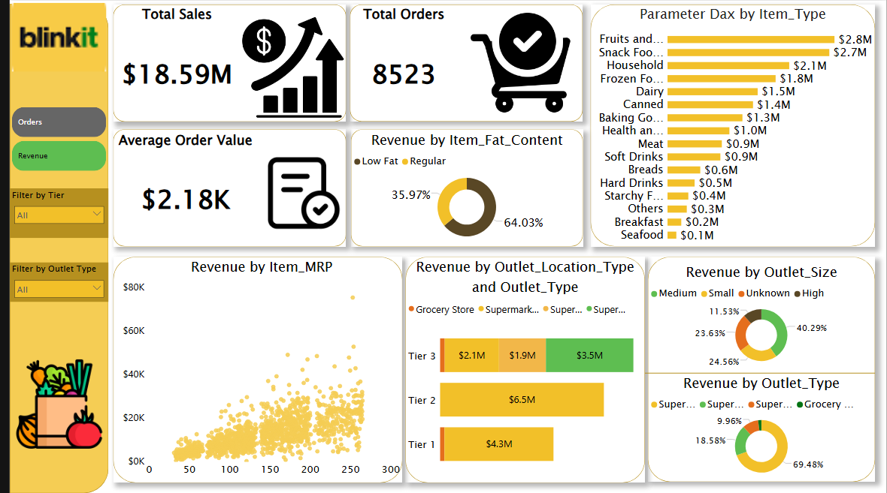

# Retail Performance & Expansion Strategy Analysis

## 📊 Project Overview
This project analyzes retail sales data to evaluate outlet performance, product trends, and pricing dynamics.

The goal is to identify key revenue drivers and provide data-driven recommendations for business expansion and operational optimization.

---

## 🎯 Business Problem
The business needs to:
- Identify high-performing outlet types and locations
- Optimize product mix and pricing strategy
- Improve revenue efficiency across stores
- Support expansion decisions with data

---

## 🛠️ Tools Used
- Power BI
- Data Modeling (DAX)

---

## 📊 Dashboard Preview

---

## 🔍 Key Insights & Recommendations

### 🏪 Outlet Performance
- Supermarket Type 1 dominates revenue and orders  
- Grocery stores generate 12% of orders but only 2% of revenue  

👉 Customers make smaller purchases in grocery stores  

**Recommendation:**  
Increase average order value through bundles and cross-selling.

---

### 🌍 Location Tier Performance
- Tier 3 locations generate the highest revenue  
- Supermarket Type 3 performs strongly despite limited presence  

**Recommendation:**  
Expand Supermarket Type 3 into Tier 2 markets.

---

### 📏 Outlet Size Performance
- Medium outlets outperform large outlets  

**Recommendation:**  
Focus expansion on medium-sized outlets for optimal efficiency.

---

### 💰 Pricing & Product Dynamics
- No strong link between item weight and price  
- Revenue increases with item quantity  

**Recommendation:**  
Adopt quantity-based pricing strategies.

---

### 🥗 Product Attributes
- Low-fat items generate ~65% of revenue  

**Recommendation:**  
Increase availability and promotion of low-fat products.

---

### 📦 Category Performance
- Fruits and vegetables dominate sales  

**Recommendation:**  
Use as anchor products for promotions and retention strategies.

---

### 👁️ Visibility Analysis
- No strong correlation between visibility and performance  

**Recommendation:**  
Focus on pricing, placement, and branding instead of visibility alone.

---

## 💼 Business Value
This analysis helps businesses:
- Improve revenue efficiency  
- Optimize store expansion strategy  
- Enhance product and pricing decisions  
- Increase overall profitability  

---

## 🚀 Application
This approach can be applied to real retail data to support strategic growth and operational improvements.
